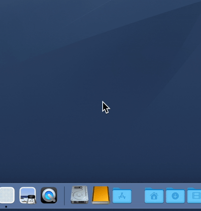

# RePoof
An injection that displays the lost Poof effect of the Dock (experiment).

## The Poof API

`NSAnimationEffect.poof` is used to display Poof. This is a perfectly legal API.

[https://developer.apple.com/documentation/appkit/nsanimationeffect](https://developer.apple.com/documentation/appkit/nsanimationeffect)

## Catching user events sent to the Dock

Tap events with CGEvent API. I have included my own [EventTapper](https://github.com/usagimaru/EventTapper) via Swift PM.

## Calculate the threshold point at which a Dock tile is removed by user dragging

A certain amount of mouse movement is required for a Dock tile to be removed by user dragging. I have analyzed the Dock's behaviors and found a way to calculate the threshold for that distance of movement.

The formula is simple.

> `threshold = largeTileSize * 2 + 38`

`largeTileSize` is the tile size of the Dock when magnified. This value is recorded in the Dock's preferences plist file and is a field keyed `largesize`.

`38` is the magic number that I calculated visually. I did not measure it precisely, so this value may be inaccurate.

## Cases not fully taken into consideration

- User events sent to the Dock may not be caught correctly
- If the Dock is placed on the left or right side
- Calculation of the Dock Height
- Drawing position of a Poof effect
- Processing when a user aborts a drag with the Escape key
- Branch processing when a user drags a tile that cannot be removed
- Coverage of tile types that can be registered in the Dock
